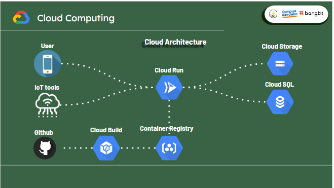

# Capstone Project API

Using Flask to build a Restful API Server with Swagger document.

Integration with Flask-smorest, Flask-GoogleStorage, Flask-SQLalchemy,and Flask-jwt-exended extensions.

### Requirements:

- Python 3 : [Python](https://www.python.org/)
- Env : See env example
- Database : Make the database to store data
- cloudbuild.yaml (for deployment)
- Dockerfile (for deployment)

### Extension:

- Smorest: [Flask-smorest](https://flask-smorest.readthedocs.io/en/latest/)

- SQL ORM: [Flask-SQLalchemy](https://flask-sqlalchemy.palletsprojects.com/en/3.0.x/)

- Google Cloud Storage: [Flask-GoogleStorage](https://flask-googlestorage.readthedocs.io/en/latest/)

- Jwt: [Flask-JWT-Extended](https://flask-jwt-extended.readthedocs.io/en/stable/)

## Installation

Create an environment:

```
py -3 -m venv .venv
```

Activate the environment:

```
.venv\Scripts\activate
```

Install with pip:

```
pip install -r requirements.txt
```

## Run Flask

### Run flask for develop

```
$ flask run
```

In flask, Default port is `5000`

Swagger document page: `http://127.0.0.1:5000/api/v1/swagger-ui`

### Deployment

```
git checkout doss
git push origin doss
```

Deployment automatic using cloud build, and the triger is 'push to branch doss'
make cure the database config use Google cloud config

## Configuration

### Development Database config

```
SQLALCHEMY_DATABASE_URI = ("mysql+pymysql://" + USERNAME + ":" + PASSWORD + "@" + HOST + "/" + DATABASE)
```

### Deployment Database config

```
from util.config import getconn
app.config["SQLALCHEMY_ENGINE_OPTIONS"] = {"creator": getconn}

### Jwt config
```

JWT_SECRET_KEY = "???"
JWT_TOKEN_LOCATION = ["headers"]
JWT_HEADER_NAME = "Authorization"
JWT_HEADER_TYPE = "Bearer"

# Capstone Google Cloud Architecture



Our project on Google Cloud incorporates various technologies to optimize its architecture. We utilize Flask, a Python web framework, for developing the API. To ensure smooth deployment, we rely on Cloud Run, a serverless platform for containerized applications. For structured data storage, we employ Cloud SQL, a scalable and highly available relational database service. Cloud Storage is utilized for storing unstructured data, offering a cost-effective and reliable solution. Streamlining the deployment process to Cloud Run is achieved through Cloud Build, a versatile service for building, testing, and deploying applications
